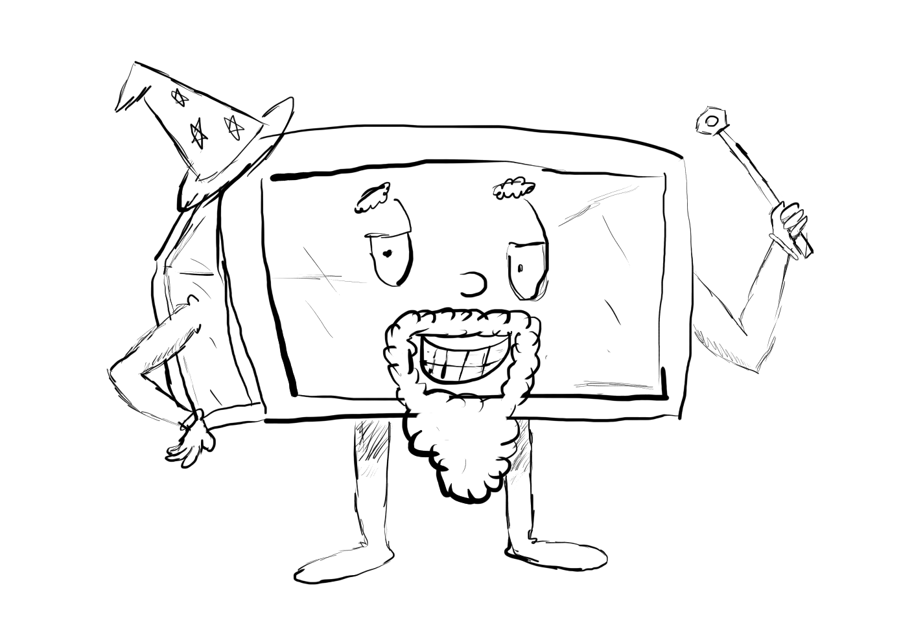

# Documentation


## Scripting

Most of the program's functionality is determined through TSC files. By default the program loads `./data/Script.tsc.txt` on startup, but ~~different files can be loaded from the script itself after the initial load.~~ *(todo: implement this)*

### What is TSC?
TSC originally comes from [Cave Story](https://www.cavestory.org/game-info/about-cave-story.php), a 2004 indie-videogame made by Japanese developer Daisuke "Pixel" Amaya. The game uses these "tsc" files to control ingame events and cutscenes, though by default, they're stored in a semi-encrypted manner (as opposed to this software which just uses plaintext documents). Many of the commands used by this software are direct ports of those commands from Cave Story, though some have been changed to work in this context.

### Format

TSC follows a relatively simple format containing "Events" and "Commands". Events are a 4 digit number starting with a hashtag. Commands are a 3 letter code beginning with `<`. After this, there can be 0 or more "arguments" delimited by `:`. Arguments can either be 4 digit numbers just like the events or can be strings. Comments work with the standard "C" styling, with either `//` marking a line to be ignored, or `/**/` marking a section to be ignored.
```
//"Event" 1000
#1000
//commands go below, down here.
<WAI0001:0000 //this command takes 2 numeric arguments
<AVL0000:Media.mp4$ //This command takes a string argument, note the '$' delimiter

//whitespace does not matter. commands can be one-per-line, or stacked back-to-back.


//With the MSG command, all lines leading up to the next command are read and written to the terminal
<MSGHello.
All
these

lines
are
written at the
same...

time
<SLR //the next command marks the end of the MSG command.
<END
```
Any commands with too few arguments or with the wrong argument types are ignored, and the next one on the line is executed.

Just like the original "Cave Story" TSC, numeric arguments (including event numbers) are based on ASCII offsets, so 4-digit arguments don't strictly have to be numbers from `0-9`. This allows for numbers larger than `9999` as arguments, or smaller than `0000`.

Here's a snippet from the parsing code that shows how this works fairly well:
```
//intentional no-underflow checking (allows for OOB and negative values, which could be useful)
number += (input[0] - '0') * 1000;
number += (input[1] - '0') * 100;
number += (input[2] - '0') * 10;
number += input[3] - '0';
```
Example:
The argument `000F` turns into number `22` because the character `F` is 22 "spots" away from the ascii char `0`. Likewise `000G` turns into `23`, and `000!` is `-15`.

Of course, commands have been made so this "feature" shouldn't ever need to be used, but it is still worthy of note.

### Commands

These are the commands that are implemented in the program, divided by what executes them. Unrecognized commands are forwarded to the final peripheral device, which simply ignores them.

#### Computer-executed commands
These are handled in the DungeonMaster application and are never sent out.

- `<MSG` - *MeSsaGe* - Puts a message on the terminal, good for debugging or getting execution feedback
- `<WAI[seconds]:[milliseconds]` - *WAIt* - Halts the script execution for seconds + milliseconds. If the state is not `KEYed` and another command is pushed to the command queue, this command will be cut short and that one executed instead. *(see: `KEY` and `FRE`)*.
- `<PSH[sub-event]` - *PuSH event* - Jumps to this event and runs the code there until `<POP` is encountered, then returns to this event. (Think of this as a function)
- `<POP` - *POP event* - Returns execution to the parent event. If no parent event has been exists, this behaves the same as `<END`.
- `<KEY` - *KEY* - Prevents new command execution requests from interrupting a `WAI` command until the event is done. `KEY` state persists between events, so be sure to call `FRE` if you do not want this to happen.
- `<FRE` - *FReE* - Allows new execution requests to happen immediately. If there are events in the queue when `<FRE` is called, they will be drained in-order as soon as execution ends or `<WAI` is encountered.
- `<EVE[event]` - *EVEnt* - Go to event, similar to `<PSH`, except you do not return to the calling event once the next event is finished. (Think of this as a "go-to" statement)
- `<END` - *END* - Indicates the end of a script event, the parser will stop and execute other events in the queue, if available. If `<END` is called from within a `<PSH` sub-event, it will not return to the caller and be ended immediately, same as for normal events.
- `<FL+[flag number]` - *FLag Add* - Sets this flag to "true", there are a total of 8000 flags, numbered 0000-7999, variables beyond this are ignored.
- `<FL-[flag number]` - *FLag Remove* - Sets this flag to "false"
- `<FLJ[flag number]:[event number]` - *FLag Jump* - Jumps to event if the flag has been marked as **true**.
- `<FNJ[flag number]:[event number]` - *Flag Not Jump* - Jumps to event if the flag has been marked as **false**.
- `<FLC` - *FLag Clear* - Resets all flags to "false"
- `<SWG` - *StopWatch Go* - Starts the "stopwatch" timer counting up on the scoreboard.
- `<SWH` - *StopWatch Halt* - Halts the "stopwatch" timer on the scoreboard.
- `<SWR` - *StopWatch Reset* - Resets the "stopwatch" timer back to 0.
- `<TIG` - *TImer Go* - Starts the "main" timer counting down on the scoreboard.
- `<TIH` - *TImer Halt* - Halts the "main" timer on the scoreboard.
- `<TIA[minutes]:[seconds]` - *TImer Add* - Adds times to the current time.
- `<TIS[minutes]:[seconds]` - *TImer Subtract* - Subs times from the current time.
- `<TEU[event]:[minutes]:[seconds]` - *Timer Event pUsh* - adds an event to be run when the timer hits this time. If the event has already been added, the time it is executed in is changed to reflect the new time.
- `<TEO[event]` - *Timer Event pOp* - removes the event from the list to be executed.
- `<TEC` - *Timer Event Clear* - clears all events from the execution list
- `<AVL[buffer number]:[string_argument_local_path$]` - *Audio Video Load* - Loads an audio or video clip into the specified buffer (0 or 1) to be played later.
- `<AVU[buffer number]` - *Audio Video Unload* - Unloads the media from this buffer. This is mainly to conserve computer memory when a media element is not being used. Running `<AVL` automatically unloads the old video before loading the new one.
- `<AVH[buffer number]` - *Audio Video Hide* - Hides this buffer on the scoreboard, but does not stop its playback.
- `<AVV[buffer number]` - *Audio Video Visible* - Shows the buffer on the scoreboard, but does not play it.
- `<AVP[buffer number]` - *Audio Video Pause* - Pauses the media without resetting it.
- `<AVY[buffer number]` - *Audio Video plaY* - Resumes or starts media element playback.
- `<AVS[buffer number]` - *Audio Video Stop* - Stops media playback and resets it to the start.
- `<IMS[string_argument_local_path]` - *IMage Show* - Shows an image on the scoreboard.
- `<IMH` - *IMage Show* - Hides the shown image.

#### Dongle-executed commands
These commands are intercepted by the dongle, regardless of what the target endpoint is set to. (this is required to, well... set the endpoint.)

- `<TGT[peripheral UUID]` - Sets the destination target for TSC commands to this device. UUIDs are defined in the `Firmware/Common/configuration/include/configuration.h` file. It's part of the `DeviceInfo` struct, and is typically a positive integer.

#### Peripheral-executed commands
These commands are sent to one peripheral at a time, determined by the value passed into `<TGT` earlier.

*To-do: many of these commands aren't implemented yet because I don't have access to the exact hardware specifications of the box these will service. In theory, adding commands here will be trivial since these are directly ignored by the desktop software.*


- `<SLT[mode]:[arg1]:[arg2]` - *Set Lighting Targets* - Tells the target what lights to address when applying effects, depending on the following `[mode]`:
  - `0000`: **All**: `[arg1]` and `[arg2]` are ignored
  - `0001`: **Address single `[arg1]`**: `[arg2]` is ignored
  - `0002`: **Address range from `[arg1]` to `[arg2]`**

- `<STS[seconds]:[milliseconds]` - *Set light Transition Speed* - Effects invoked after this command will play at this speed (taking X time to loop). (effects before will have whatever speed was set for them instead)
- `<SLC[rrrr]:[gggg]:[bbbb]` - *Set Light Color* - to RGB, from range 0-255. Values outside this range are truncated.
- `<SLR` - *Set Light Rainbow* - No arguments, speed set above
- `<SLS[r1]:[g1]:[b1]:[r2]:[g2]:[b2]` - *Set Light Strobe* - flashes between 2 colors, RGB1 and RGB2


